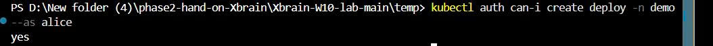
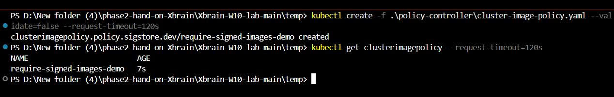

# W10 Evidence

## 1. Thông tin bài Lab

**Lab:** W10 Morning — Lab 1.1, Lab 1.2, Lab 1.3
**Chủ đề:** Secure & Operate — RBAC + Gatekeeper + GitOps
**Sinh viên:** Ngô Nguyễn Trường An
**Repository:** `https://github.com/ngoNguyenTruongAn/Xbrain-W10-temp.git`
**Cluster:** Minikube profile `w10`
**Namespace sử dụng:** `demo`

---

# Lab 1.1 — RBAC

## 2. Mục tiêu Lab 1.1

Mục tiêu của Lab 1.1 là cấu hình Kubernetes RBAC thông qua GitOps bằng mô hình App-of-Apps của ArgoCD.

Lab yêu cầu tạo ba user với ba nhóm quyền khác nhau:

| User    | Role      | Quyền mong đợi                                            |
| ------- | --------- | --------------------------------------------------------- |
| `alice` | Developer | Có thể tạo, cập nhật, xóa workload trong namespace `demo` |
| `bob`   | SRE       | Có thể xem và vận hành pod trên toàn cluster              |
| `carol` | Viewer    | Chỉ có quyền đọc tài nguyên trên toàn cluster             |

Điểm quan trọng của lab là RBAC phải được quản lý thông qua Git và ArgoCD, không cấu hình thủ công bằng `kubectl apply`.

---

## 3. Thay đổi trong GitOps Repository

Các file sau đã được thêm hoặc cập nhật trong repository.

### 3.1 Cập nhật Root Application

File:

```text
argocd/root.yaml
```

Mục đích:

```text
Root ArgoCD Application sử dụng mô hình App-of-Apps.
Nó trỏ đến thư mục argocd/apps.
Tất cả child applications sẽ được quản lý từ thư mục này.
```

Cấu hình quan trọng:

```yaml
repoURL: https://github.com/ngoNguyenTruongAn/Xbrain-W10-temp.git
path: argocd/apps
targetRevision: main
```

---

### 3.2 Thêm RBAC Child Application

File:

```text
argocd/apps/rbac.yaml
```

Mục đích:

```text
File này đăng ký RBAC như một ArgoCD child application.
Nó yêu cầu ArgoCD đồng bộ toàn bộ manifest RBAC từ thư mục rbac/.
```

Cấu hình quan trọng:

```yaml
apiVersion: argoproj.io/v1alpha1
kind: Application
metadata:
  name: rbac
  namespace: argocd
spec:
  source:
    repoURL: https://github.com/ngoNguyenTruongAn/Xbrain-W10-temp.git
    path: rbac
    targetRevision: main
```

---

### 3.3 Thêm RBAC Manifests

Folder:

```text
rbac/
```

Files:

```text
rbac/roles.yaml
rbac/rolebindings.yaml
```

Mục đích:

```text
roles.yaml định nghĩa quyền RBAC.
rolebindings.yaml gán các quyền đó cho alice, bob và carol.
```

---

## 4. Evidence cài đặt Cluster và ArgoCD

### 4.1 Trạng thái Kubernetes Node

Command:

```powershell
kubectl get nodes
```

Evidence:


Kết quả:

```text
PASS — Kubernetes cluster đang chạy và node ở trạng thái Ready.
```

---

### 4.2 Trạng thái ArgoCD Pods

Command:

```powershell
kubectl get pods -n argocd
```

Evidence:


Kết quả:

```text
PASS — ArgoCD đã được cài đặt và các pod cần thiết đang chạy.
```

---

## 5. Evidence App-of-Apps

### 5.1 Deploy Root Application

Command:

```powershell
kubectl apply -f argocd/root.yaml
```

Evidence:


Kết quả:

```text
PASS — Root ArgoCD Application được tạo thành công.
```

---

### 5.2 Trạng thái ArgoCD Applications

Command:

```powershell
kubectl get applications -n argocd
```

Evidence:


Kết quả quan trọng:

```text
root   = Synced / Healthy
rbac   = Synced / Healthy
common = Synced / Healthy
```

Kết quả:

```text
PASS — Mô hình App-of-Apps hoạt động đúng, và RBAC child application đã Synced / Healthy.
```

Ghi chú:

```text
Một số application từ W9 như api, alert và kube-prometheus-stack không phải trọng tâm kiểm tra của Lab 1.1 RBAC.
Application quan trọng trong bước này là rbac.
```

---

## 6. Evidence kiểm tra RBAC Authorization

### 6.1 Alice có thể tạo Deployment trong namespace demo

Command:

```powershell
kubectl auth can-i create deploy -n demo --as alice
```

Evidence:



Giải thích:

```text
alice là Developer nên được phép tạo workload trong namespace demo.
```

Kết quả:

```text
PASS — alice có quyền tạo Deployment trong namespace demo.
```

---

### 6.2 Alice không thể tạo Deployment trong kube-system

Command:

```powershell
kubectl auth can-i create deploy -n kube-system --as alice
```

Evidence:


Giải thích:

```text
alice chỉ được bind với Developer Role trong namespace demo.
Vì vậy alice không được phép thao tác trong namespace kube-system.
```

Kết quả:

```text
PASS — alice không có quyền tạo Deployment trong kube-system.
```

---

### 6.3 Bob có thể get pods trên toàn cluster

Command:

```powershell
kubectl auth can-i get pods -A --as bob
```

Evidence:


Giải thích:

```text
bob là SRE nên có quyền kiểm tra pod trên toàn cluster.
```

Kết quả:

```text
PASS — bob có quyền get pods trên toàn cluster.
```

---

### 6.4 Carol không thể delete nodes

Command:

```powershell
kubectl auth can-i delete nodes --as carol
```

Evidence:


Giải thích:

```text
carol là Viewer nên chỉ có quyền đọc.
Cảnh báo nodes là cluster-scoped resource là bình thường.
Kết quả quan trọng là "no", nghĩa là carol không thể delete nodes.
```

Kết quả:

```text
PASS — carol không có quyền delete nodes.
```

---

## 7. Kết luận Lab 1.1

```text
Lab 1.1 đã hoàn thành thành công.

RBAC được cấu hình thông qua GitOps bằng ArgoCD.
Ba user alice, bob và carol được gán quyền đúng theo vai trò.
Các lệnh kubectl auth can-i cho kết quả đúng với yêu cầu phân quyền.
Root Application và RBAC Application đều được quản lý bởi ArgoCD.
```

---

# Lab 1.2 — Gatekeeper Policy Enforcement

## 8. Mục tiêu Lab 1.2

Mục tiêu của Lab 1.2 là cài đặt OPA Gatekeeper thông qua GitOps và enforce các admission policy để chặn manifest Kubernetes không an toàn.

Lab yêu cầu enforce bốn luật:

| # | Policy Rule                    | Kết quả mong đợi                              |
| - | ------------------------------ | --------------------------------------------- |
| 1 | Cấm image tag `:latest`        | Pod dùng `nginx:latest` phải bị reject        |
| 2 | Bắt buộc có `resources.limits` | Pod thiếu CPU và memory limits phải bị reject |
| 3 | Cấm `runAsUser: 0`             | Pod chạy root user phải bị reject             |
| 4 | Cấm `hostNetwork: true`        | Pod dùng host network phải bị reject          |

Tất cả policy phải được quản lý thông qua Git và ArgoCD.

---

## 9. Thay đổi trong GitOps Repository

### 9.1 Thêm Gatekeeper Controller Application

File:

```text
argocd/apps/gatekeeper.yaml
```

Mục đích:

```text
File này cài đặt OPA Gatekeeper controller vào cluster.
Gatekeeper hoạt động như một admission controller để kiểm tra tài nguyên Kubernetes trước khi tài nguyên được tạo.
```

Cấu hình quan trọng:

```yaml
apiVersion: argoproj.io/v1alpha1
kind: Application
metadata:
  name: gatekeeper
  namespace: argocd
spec:
  source:
    repoURL: https://open-policy-agent.github.io/gatekeeper/charts
    chart: gatekeeper
    targetRevision: 3.22.2
  destination:
    server: https://kubernetes.default.svc
    namespace: gatekeeper-system
```

---

### 9.2 Thêm Gatekeeper Templates Application

File:

```text
argocd/apps/gatekeeper-templates.yaml
```

Mục đích:

```text
File này đồng bộ các Gatekeeper ConstraintTemplate từ thư mục gatekeeper/templates.
ConstraintTemplate định nghĩa logic policy và tạo ra các custom constraint kinds.
```

Cấu hình quan trọng:

```yaml
apiVersion: argoproj.io/v1alpha1
kind: Application
metadata:
  name: gatekeeper-templates
  namespace: argocd
spec:
  source:
    repoURL: https://github.com/ngoNguyenTruongAn/Xbrain-W10-temp.git
    path: gatekeeper/templates
    targetRevision: main
```

---

### 9.3 Thêm Gatekeeper Constraints Application

File:

```text
argocd/apps/gatekeeper-constraints.yaml
```

Mục đích:

```text
File này đồng bộ các Gatekeeper Constraints từ thư mục gatekeeper/constraints.
Constraints cấu hình và enforce policy dựa trên các ConstraintTemplate.
```

Cấu hình quan trọng:

```yaml
apiVersion: argoproj.io/v1alpha1
kind: Application
metadata:
  name: gatekeeper-constraints
  namespace: argocd
spec:
  source:
    repoURL: https://github.com/ngoNguyenTruongAn/Xbrain-W10-temp.git
    path: gatekeeper/constraints
    targetRevision: main
```

---

### 9.4 Thêm ConstraintTemplates từ Gatekeeper Library

Folder:

```text
gatekeeper/templates/
```

Files:

```text
gatekeeper/templates/k8sdisallowedtags-template.yaml
gatekeeper/templates/k8srequiredresources-template.yaml
gatekeeper/templates/k8spspallowedusers-template.yaml
gatekeeper/templates/k8spsphostnetworkingports-template.yaml
```

Mục đích:

```text
Các template này được lấy từ Gatekeeper Library.
Chúng cung cấp logic policy có sẵn cho các rule bảo mật phổ biến trong Kubernetes.
```

Các template sử dụng:

| Template                    | Mục đích                          |
| --------------------------- | --------------------------------- |
| `K8sDisallowedTags`         | Cấm image tag như `latest`        |
| `K8sRequiredResources`      | Bắt buộc khai báo resource limits |
| `K8sPSPAllowedUsers`        | Cấm container chạy với root user  |
| `K8sPSPHostNetworkingPorts` | Cấm hostNetwork và hostPort       |

---

### 9.5 Thêm bốn Gatekeeper Constraints

Folder:

```text
gatekeeper/constraints/
```

Files:

```text
gatekeeper/constraints/disallow-latest-tag.yaml
gatekeeper/constraints/required-resource-limits.yaml
gatekeeper/constraints/disallow-run-as-root.yaml
gatekeeper/constraints/disallow-host-network.yaml
```

Mục đích:

```text
Các constraint này enforce bốn admission rules trong namespace demo.
Tất cả constraint đều sử dụng enforcementAction: deny.
```

Tóm tắt cấu hình:

| Constraint                 | Kind                        | Enforcement |
| -------------------------- | --------------------------- | ----------- |
| `disallow-latest-tag`      | `K8sDisallowedTags`         | `deny`      |
| `required-resource-limits` | `K8sRequiredResources`      | `deny`      |
| `disallow-run-as-root`     | `K8sPSPAllowedUsers`        | `deny`      |
| `disallow-host-network`    | `K8sPSPHostNetworkingPorts` | `deny`      |

---

## 10. Evidence cài đặt Gatekeeper

### 10.1 Trạng thái Gatekeeper Pods

Command:

```powershell
kubectl get pods -n gatekeeper-system
```

Evidence:


Kết quả:

```text
PASS — Gatekeeper controller đang chạy trong namespace gatekeeper-system.
```

---

### 10.2 Trạng thái ArgoCD Applications

Command:

```powershell
kubectl get applications -n argocd
```

Evidence:


Kết quả quan trọng:

```text
gatekeeper              = Synced / Healthy
gatekeeper-templates    = Synced / Healthy
gatekeeper-constraints  = Synced / Healthy
root                    = Synced / Healthy
```

Kết quả:

```text
PASS — Gatekeeper controller, templates và constraints đều được quản lý bởi ArgoCD thông qua GitOps.
```

---

## 11. Evidence ConstraintTemplates

Command:

```powershell
kubectl get constrainttemplate
```

Evidence:


Kết quả:

```text
PASS — Các ConstraintTemplate cần thiết đã được tạo thành công.
```

---

## 12. Evidence Constraints

Command:

```powershell
kubectl get k8sdisallowedtags
kubectl get k8srequiredresources
kubectl get k8spspallowedusers
kubectl get k8spsphostnetworkingports
```

Evidence:


Kết quả mong đợi:

```text
ENFORCEMENT-ACTION = deny
```

Kết quả:

```text
PASS — Bốn Gatekeeper constraints đang hoạt động ở chế độ deny.
```

---

## 13. Evidence kiểm tra Policy

### 13.1 Test 1 — Cấm image tag `:latest`

Command:

```powershell
@"
apiVersion: v1
kind: Pod
metadata:
  name: test-latest
  namespace: demo
spec:
  securityContext:
    runAsUser: 1000
  containers:
  - name: test-latest
    image: nginx:latest
    resources:
      limits:
        cpu: 100m
        memory: 128Mi
"@ | kubectl apply --dry-run=server -f -
```

Evidence:


Kết quả quan sát được:

```text
Error from server (Forbidden):
[disallow-latest-tag] container <test-latest> uses a disallowed tag <nginx:latest>; disallowed tags are ["latest"]
```

Kết quả:

```text
PASS — API Server reject Pod vì sử dụng image tag nginx:latest.
```

---

### 13.2 Test 2 — Bắt buộc `resources.limits`

Command:

```powershell
@"
apiVersion: v1
kind: Pod
metadata:
  name: test-no-limits
  namespace: demo
spec:
  securityContext:
    runAsUser: 1000
  containers:
  - name: test-no-limits
    image: nginx:1.25
"@ | kubectl apply --dry-run=server -f -
```

Evidence:


Kết quả quan sát được:

```text
Error from server (Forbidden):
[required-resource-limits] container <test-no-limits> does not have <{"cpu", "memory"}> limits defined
```

Kết quả:

```text
PASS — API Server reject Pod vì container không khai báo CPU và memory limits.
```

---

### 13.3 Test 3 — Cấm `runAsUser: 0`

Command:

```powershell
@"
apiVersion: v1
kind: Pod
metadata:
  name: test-root-user
  namespace: demo
spec:
  securityContext:
    runAsUser: 0
  containers:
  - name: test-root-user
    image: nginx:1.25
    resources:
      limits:
        cpu: 100m
        memory: 128Mi
"@ | kubectl apply --dry-run=server -f -
```

Evidence:


Kết quả quan sát được:

```text
Error from server (Forbidden):
[disallow-run-as-root] Container test-root-user is attempting to run as disallowed user 0.
```

Kết quả:

```text
PASS — API Server reject Pod vì Pod cố chạy với root user.
```

---

### 13.4 Test 4 — Cấm `hostNetwork: true`

Command:

```powershell
@"
apiVersion: v1
kind: Pod
metadata:
  name: test-host-network
  namespace: demo
spec:
  hostNetwork: true
  securityContext:
    runAsUser: 1000
  containers:
  - name: test-host-network
    image: nginx:1.25
    resources:
      limits:
        cpu: 100m
        memory: 128Mi
"@ | kubectl apply --dry-run=server -f -
```

Evidence:


Kết quả quan sát được:

```text
Error from server (Forbidden):
The specified hostNetwork and hostPort are not allowed.
```

Kết quả:

```text
PASS — API Server reject Pod vì hostNetwork không được phép sử dụng.
```

---

### 13.5 Test 5 — Manifest hợp lệ được phép pass

Command:

```powershell
@"
apiVersion: v1
kind: Pod
metadata:
  name: test-valid-pod
  namespace: demo
spec:
  securityContext:
    runAsUser: 1000
  containers:
  - name: test-valid-pod
    image: nginx:1.25
    resources:
      limits:
        cpu: 100m
        memory: 128Mi
"@ | kubectl apply --dry-run=server -f -
```

Evidence:


Kết quả quan sát được:

```text
pod/test-valid-pod created (server dry run)
```

Kết quả:

```text
PASS — Pod hợp lệ được API Server cho phép vì không vi phạm policy nào.
```

---

## 14. Evidence Platform vẫn hoạt động sau khi bật enforce

### 14.1 Trạng thái API Pods

Command:

```powershell
kubectl get pods -n demo
```

Evidence:


Kết quả quan trọng:

```text
api-xxxxx   1/1   Running
api-xxxxx   1/1   Running
api-xxxxx   1/1   Running
api-xxxxx   1/1   Running
```

Kết quả:

```text
PASS — Workload API vẫn chạy sau khi Gatekeeper enforcement được bật.
```

---

### 14.2 Trạng thái API Rollout

Command:

```powershell
kubectl get rollout api -n demo
```

Evidence:


Kết quả quan trọng:

```text
DESIRED   CURRENT   UP-TO-DATE   AVAILABLE
4         4         4            4
```

Kết quả:

```text
PASS — Platform từ W9 vẫn healthy sau khi bật Gatekeeper policy enforcement.
```

---

## 15. Kết luận Lab 1.2

```text
Lab 1.2 đã hoàn thành thành công.

OPA Gatekeeper được cài đặt và quản lý thông qua GitOps.
Bốn admission policies được enforce bằng Gatekeeper Library ConstraintTemplates và Constraints.
Các manifest vi phạm đều bị Kubernetes API Server reject.
Manifest hợp lệ được cho phép pass.
Platform API vẫn chạy ổn định sau khi bật enforcement.
```

---

# Lab 1.3 — Custom Policy

## 16. Mục tiêu Lab 1.3

Mục tiêu của Lab 1.3 là tự viết một Gatekeeper ConstraintTemplate bằng Rego.

Rule được chọn:

```text
Reject Deployment nếu replicas > 5.
```

Kết quả mong đợi:

| Test Case                   | Kết quả mong đợi |
| --------------------------- | ---------------- |
| Deployment có `replicas: 6` | Bị reject        |
| Deployment có `replicas: 3` | Được allow       |

---

## 17. Thay đổi trong GitOps Repository

### 17.1 Thêm Custom ConstraintTemplate

File:

```text
gatekeeper/templates/k8sdeploymentreplicalimit-template.yaml
```

Mục đích:

```text
File này định nghĩa một custom Gatekeeper ConstraintTemplate được viết bằng Rego.
Template này tạo ra một custom constraint kind tên là K8sDeploymentReplicaLimit.
```

Cấu hình quan trọng:

```yaml
apiVersion: templates.gatekeeper.sh/v1
kind: ConstraintTemplate
metadata:
  name: k8sdeploymentreplicalimit
spec:
  crd:
    spec:
      names:
        kind: K8sDeploymentReplicaLimit
```

Logic Rego:

```rego
violation[{"msg": msg}] {
  input.review.kind.kind == "Deployment"
  replicas := input.review.object.spec.replicas
  max := input.parameters.maxReplicas
  replicas > max
  msg := sprintf("deployment <%s> has replicas %v, which exceeds the allowed maximum %v", [input.review.object.metadata.name, replicas, max])
}
```

Giải thích:

```text
Policy kiểm tra resource loại Deployment.
Nếu số replicas của Deployment lớn hơn maxReplicas được cấu hình trong Constraint, Gatekeeper sẽ tạo violation.
Vì Constraint sử dụng enforcementAction: deny, request vi phạm sẽ bị API Server reject.
```

---

### 17.2 Thêm Custom Constraint

File:

```text
gatekeeper/constraints/deployment-replica-limit.yaml
```

Mục đích:

```text
File này tạo Constraint sử dụng custom kind K8sDeploymentReplicaLimit.
Constraint cấu hình maxReplicas = 5 và enforce policy ở chế độ deny.
```

Cấu hình quan trọng:

```yaml
apiVersion: constraints.gatekeeper.sh/v1beta1
kind: K8sDeploymentReplicaLimit
metadata:
  name: deployment-replica-limit
spec:
  enforcementAction: deny
  match:
    kinds:
    - apiGroups: ["apps"]
      kinds: ["Deployment"]
    namespaces:
    - demo
  parameters:
    maxReplicas: 5
```

---

## 18. Evidence Custom ConstraintTemplate

Command:

```powershell
kubectl get constrainttemplate
```

Evidence:


Kết quả mong đợi:

```text
k8sdeploymentreplicalimit
```

Kết quả:

```text
PASS — Custom ConstraintTemplate được tạo thành công.
```

---

## 19. Evidence Custom Constraint

Command:

```powershell
kubectl get k8sdeploymentreplicalimit
```

Evidence:


Kết quả mong đợi:

```text
deployment-replica-limit   deny
```

Kết quả:

```text
PASS — Custom constraint đang hoạt động ở chế độ deny.
```

---

## 20. Evidence kiểm tra Custom Policy

### 20.1 Test 1 — Deployment có `replicas: 6` phải bị reject

Command:

```powershell
@"
apiVersion: apps/v1
kind: Deployment
metadata:
  name: test-too-many-replicas
  namespace: demo
spec:
  replicas: 6
  selector:
    matchLabels:
      app: test-too-many-replicas
  template:
    metadata:
      labels:
        app: test-too-many-replicas
    spec:
      securityContext:
        runAsUser: 1000
      containers:
      - name: nginx
        image: nginx:1.25
        resources:
          limits:
            cpu: 100m
            memory: 128Mi
"@ | kubectl apply --dry-run=server -f -
```

Evidence:


Kết quả quan sát được:

```text
Error from server (Forbidden):
[deployment-replica-limit] deployment <test-too-many-replicas> has replicas 6, which exceeds the allowed maximum 5
```

Kết quả:

```text
PASS — API Server reject Deployment vì replicas lớn hơn 5.
```

---

### 20.2 Test 2 — Deployment có `replicas: 3` phải được allow

Command:

```powershell
@"
apiVersion: apps/v1
kind: Deployment
metadata:
  name: test-valid-replicas
  namespace: demo
spec:
  replicas: 3
  selector:
    matchLabels:
      app: test-valid-replicas
  template:
    metadata:
      labels:
        app: test-valid-replicas
    spec:
      securityContext:
        runAsUser: 1000
      containers:
      - name: nginx
        image: nginx:1.25
        resources:
          limits:
            cpu: 100m
            memory: 128Mi
"@ | kubectl apply --dry-run=server -f -
```

Evidence:


Kết quả quan sát được:

```text
deployment.apps/test-valid-replicas created (server dry run)
```

Kết quả:

```text
PASS — Deployment hợp lệ được API Server allow vì replicas không vượt quá giới hạn 5.
```

---

## 21. Kết luận Lab 1.3

```text
Lab 1.3 đã hoàn thành thành công.

Một custom Gatekeeper ConstraintTemplate đã được tự viết bằng Rego.
Template tạo ra custom kind K8sDeploymentReplicaLimit.
Constraint deployment-replica-limit được tạo với maxReplicas = 5 và enforcementAction = deny.
Policy reject Deployment có replicas = 6 và allow Deployment có replicas = 3.
Toàn bộ template và constraint được quản lý bằng Git và đồng bộ thông qua ArgoCD.
```

---

# 22. Tổng kết Lab 1

```text
Lab 1 đã hoàn thành đầy đủ các yêu cầu chính.

Lab 1.1:
RBAC được cấu hình qua GitOps.
Ba role alice, bob và carol được kiểm tra bằng kubectl auth can-i.

Lab 1.2:
OPA Gatekeeper được cài đặt qua ArgoCD.
Bốn policy admission được enforce thành công ở chế độ deny.
Các manifest xấu bị reject và manifest hợp lệ được allow.
Platform API vẫn healthy sau khi bật enforce.

Lab 1.3:
Một custom ConstraintTemplate bằng Rego đã được tự viết.
Custom policy reject Deployment nếu replicas > 5 hoạt động đúng.
Deployment vi phạm bị reject và Deployment hợp lệ được allow.

Tất cả thay đổi được quản lý qua Git và ArgoCD theo mô hình GitOps.
```
# Lab 2 Evidence — Secrets Management & Supply Chain Security

## Lab 2.1 — External Secrets Operator với AWS Secrets Manager

### Mục tiêu

Mục tiêu của Lab 2.1 là sử dụng External Secrets Operator để đồng bộ secret từ AWS Secrets Manager về Kubernetes. Sau đó thực hiện rotation secret trên AWS và kiểm tra Kubernetes Secret có được cập nhật tự động hay không.

Luồng hoạt động:

```text
AWS Secrets Manager
        ↓
External Secrets Operator
        ↓
ExternalSecret db-creds
        ↓
Kubernetes Secret db-secret
        ↓
Application / Pod
```

---

## 2.1.1 Cài đặt External Secrets Operator thành công

External Secrets Operator đã được cài vào namespace `external-secrets`.

Lệnh kiểm tra:

```powershell
kubectl get pods -n external-secrets --request-timeout=120s
```

Kết quả mong đợi:

```text
eso-external-secrets                    1/1   Running
eso-external-secrets-cert-controller    1/1   Running
eso-external-secrets-webhook            1/1   Running
```

Evidence:


---

## 2.1.2 Kiểm tra CRD của ESO

Các CRD cần thiết của External Secrets Operator đã được cài đặt thành công.

Lệnh kiểm tra:

```powershell
kubectl api-resources | Select-String "externalsecret|secretstore"
```

Kết quả có các resource:

```text
externalsecrets
secretstores
clusterexternalsecrets
clustersecretstores
```

Evidence:


---

## 2.1.3 Cấu hình SecretStore và ExternalSecret

Trong namespace `demo`, hệ thống sử dụng:

```text
SecretStore: aws-store
ExternalSecret: db-creds
Kubernetes Secret: db-secret
AWS Secrets Manager secret: prod/db/password
```

Lệnh kiểm tra:

```powershell
kubectl get secretstore aws-store -n demo --request-timeout=120s
kubectl get externalsecret db-creds -n demo --request-timeout=120s
```

Kết quả cho thấy `SecretStore` và `ExternalSecret` hoạt động bình thường.

Evidence:


---

## 2.1.4 Kubernetes Secret được tạo bởi ESO

External Secrets Operator đã tạo Kubernetes Secret `db-secret` trong namespace `demo`.

Lệnh kiểm tra:

```powershell
kubectl get secret db-secret -n demo --request-timeout=120s
```

Kết quả:

```text
NAME        TYPE     DATA   AGE
db-secret   Opaque   1      ...
```

Evidence:


---

## 2.1.5 Giá trị secret ban đầu được sync thành công

Giá trị ban đầu từ AWS Secrets Manager đã được sync về Kubernetes Secret.

Lệnh decode secret:

```powershell
kubectl get secret db-secret -n demo -o jsonpath="{.data.password}" | %{ [System.Text.Encoding]::UTF8.GetString([System.Convert]::FromBase64String($_)) }
```

Kết quả ban đầu:

```text
MyS3cr3tP@ss
```

Evidence:


---

## 2.1.6 Rotation secret trên AWS Secrets Manager

Secret trong AWS Secrets Manager được cập nhật sang giá trị mới.

Lệnh thực hiện:

```powershell
aws secretsmanager update-secret `
  --secret-id prod/db/password `
  --secret-string "NewP@ss123" `
  --region ap-southeast-1
```

Kết quả trả về có `ARN`, `Name`, và `VersionId`, chứng minh secret trên AWS đã được update thành công.

Evidence:


---

## 2.1.7 Kubernetes Secret được cập nhật sau rotation

Sau khi chờ ESO refresh, kiểm tra lại Kubernetes Secret.

Lệnh decode lại secret:

```powershell
kubectl get secret db-secret -n demo -o jsonpath="{.data.password}" | %{ [System.Text.Encoding]::UTF8.GetString([System.Convert]::FromBase64String($_)) }
```

Kết quả sau rotation:

```text
NewP@ss123
```

Evidence:


---

## 2.1.8 Kết luận Lab 2.1

Lab 2.1 đã hoàn thành thành công.

External Secrets Operator đã sync secret từ AWS Secrets Manager về Kubernetes. Sau khi secret trong AWS Secrets Manager được update, Kubernetes Secret `db-secret` cũng được cập nhật theo sau khoảng thời gian refresh.

Kết quả cuối cùng:

```text
Before rotation: MyS3cr3tP@ss
After rotation:  NewP@ss123
```

Điều này chứng minh cơ chế secret rotation hoạt động đúng.

---

# Lab 2.2 — Trivy, Cosign và Supply Chain Security

## Mục tiêu

Mục tiêu của Lab 2.2 là bảo vệ container supply chain bằng cách sử dụng:

```text
Trivy                  → scan vulnerability
GitHub Container Registry → lưu image
Cosign                 → ký và verify image
Sigstore Policy Controller → enforce signed image trong Kubernetes
```

Luồng CI/CD:

```text
Build Docker image
        ↓
Trivy scan
        ↓
Push image to GHCR
        ↓
Cosign sign
        ↓
Cosign verify
        ↓
Kubernetes admission policy
```

---

## 2.2.1 GitHub Actions Pipeline đã được cập nhật

Workflow `.github/workflows/build-push.yml` đã được cập nhật để thực hiện các bước:

```text
Build Docker image locally
Scan image with Trivy
Push Docker image to GHCR
Install Cosign
Sign image with Cosign
Verify image signature
Update rollout.yaml
```

Evidence:


---

## 2.2.2 Trivy Scan thành công

Image được scan bằng Trivy trong GitHub Actions. Pipeline được cấu hình để fail nếu phát hiện vulnerability mức `HIGH` hoặc `CRITICAL`.

Workflow step:

```text
Scan image with Trivy
```

Kết quả workflow pass, chứng minh image vượt qua bước scan.

Evidence:


---

## 2.2.3 Image được push lên GHCR

Sau khi Trivy scan pass, image được push lên GitHub Container Registry.

Image:

```text
ghcr.io/ngonguyentruongan/w10-api:0.0.1
```

Evidence:


---

## 2.2.4 Image được ký bằng Cosign

Image được ký bằng Cosign. Private key được lưu trong GitHub Actions Secret, không commit lên Git.

File public key được commit:

```text
signing/cosign.pub
```

File private key không được commit:

```text
cosign.key
```

Evidence:


---

## 2.2.5 Verify chữ ký image thành công

Image đã ký được verify bằng public key.

Lệnh verify:

```powershell
cosign verify --key signing/cosign.pub ghcr.io/ngonguyentruongan/w10-api@sha256:de3471737c341212588d8ddc616f85dc64164eb0240eacadb846e8b0c8266033
```

Kết quả verify:

```text
The cosign claims were validated
Existence of the claims in the transparency log was verified offline
The signatures were verified against the specified public key
```

Evidence:


---

## 2.2.6 Rollout sử dụng signed image

File `app-api/rollout.yaml` đã được cập nhật để sử dụng image từ GHCR.

Lệnh kiểm tra:

```powershell
Get-Content .\app-api\rollout.yaml | Select-String "image:"
```

Kết quả:

```text
image: ghcr.io/ngonguyentruongan/w10-api:0.0.2
```

Evidence:


---

## 2.2.7 Cài đặt Sigstore Policy Controller thành công

Sigstore Policy Controller được cài trong namespace `cosign-system`.

Lệnh kiểm tra:

```powershell
kubectl get pods -n cosign-system --request-timeout=120s
```

Kết quả:

```text
policy-controller-webhook-xxxxx   1/1   Running
```

Evidence:


---

## 2.2.8 CRD của Policy Controller đã tồn tại

Các CRD cần thiết của Sigstore Policy Controller đã được cài đặt.

Lệnh kiểm tra:

```powershell
kubectl get crd | Select-String "policy.sigstore"
```

Kết quả:

```text
clusterimagepolicies.policy.sigstore.dev
trustroots.policy.sigstore.dev
```

Lệnh kiểm tra API resource:

```powershell
kubectl api-resources | Select-String "clusterimagepolicy"
```

Kết quả:

```text
clusterimagepolicies
```

Evidence:


---

## 2.2.9 Namespace demo được bật policy enforcement

Namespace `demo` được label để Sigstore Policy Controller enforce admission policy.

Lệnh kiểm tra:

```powershell
kubectl get namespace demo --show-labels --request-timeout=120s
```

Label cần có:

```text
policy.sigstore.dev/include=true
```

Evidence:


---

## 2.2.10 ClusterImagePolicy được tạo thành công

Một `ClusterImagePolicy` tên `require-signed-images-demo` đã được tạo để enforce signed image.

Lệnh kiểm tra:

```powershell
kubectl get clusterimagepolicy --request-timeout=120s
```

Kết quả:

```text
require-signed-images-demo
```

Evidence:



---

## 2.2.11 Signed image được admission policy cho phép

Test signed image bằng server-side dry run.

Signed image sử dụng digest đã được ký:

```text
ghcr.io/ngonguyentruongan/w10-api@sha256:de3471737c341212588d8ddc616f85dc64164eb0240eacadb846e8b0c8266033
```

Lệnh test:

```powershell
kubectl apply -f .\signed-w10-api-test.yaml --dry-run=server --request-timeout=120s
```

Kết quả:

```text
pod/signed-w10-api-test created (server dry run)
```

Điều này chứng minh image đã ký được admission policy cho phép.

Evidence:


---

## 2.2.12 Unsigned image bị admission policy từ chối

Test unsigned image bằng server-side dry run.

Lệnh test:

```powershell
kubectl apply -f .\unsigned-nginx-test.yaml --dry-run=server --request-timeout=120s
```

Kết quả:

```text
admission webhook "policy.sigstore.dev" denied the request:
invalid value: nginx:1.25 must be an image digest
```

Điều này chứng minh image chưa ký hoặc không đúng policy bị từ chối bởi Sigstore Policy Controller.

Evidence:


---

## 2.2.13 Kết luận Lab 2.2

Lab 2.2 đã hoàn thành thành công.

Pipeline CI đã build image, scan bằng Trivy, push lên GHCR, ký bằng Cosign và verify chữ ký bằng public key. Sigstore Policy Controller đã được cài đặt và cấu hình trong Kubernetes. Signed image được admission policy cho phép, còn unsigned image bị từ chối.

Kết quả cuối cùng:

```text
Signed image:   allowed
Unsigned image: rejected
```

---

# Lab 2 Final Checklist

```text
[✓] ESO manifests created
[✓] External Secrets Operator installed
[✓] AWS Secrets Manager sync completed
[✓] Secret rotation completed
[✓] signing/cosign.pub committed
[✓] cosign.key not committed
[✓] GitHub Actions workflow updated
[✓] Trivy scan passed
[✓] Image pushed to GHCR
[✓] Image signed with Cosign
[✓] Image verified with Cosign
[✓] Sigstore Policy Controller installed
[✓] ClusterImagePolicy created
[✓] Signed image allowed
[✓] Unsigned image rejected
[✓] runbooks created
[✓] exception ADR created
```

---

# Kết luận cuối cùng

Lab 2 đã hoàn thành thành công.

External Secrets Operator chứng minh khả năng đồng bộ và rotation secret từ AWS Secrets Manager về Kubernetes. Supply Chain Security pipeline chứng minh image được scan vulnerability, ký bằng Cosign, verify chữ ký và enforce admission policy trong Kubernetes. Image đã ký được cho phép chạy, trong khi image chưa ký bị từ chối.
